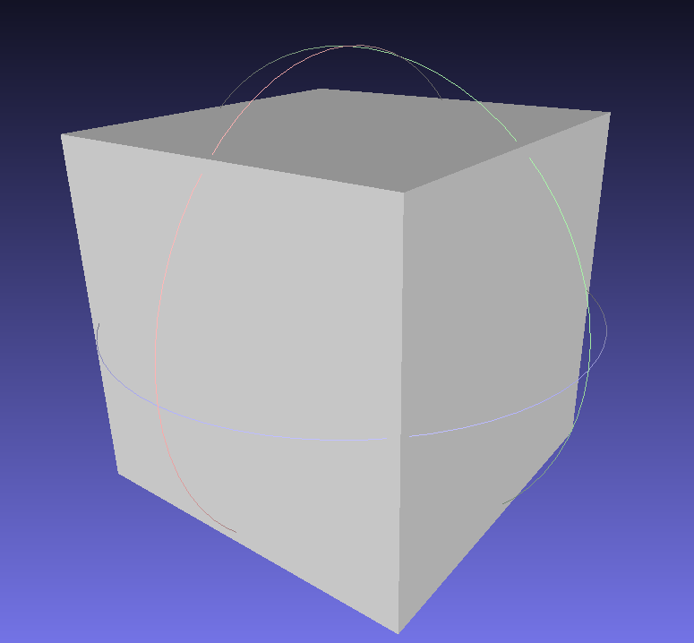
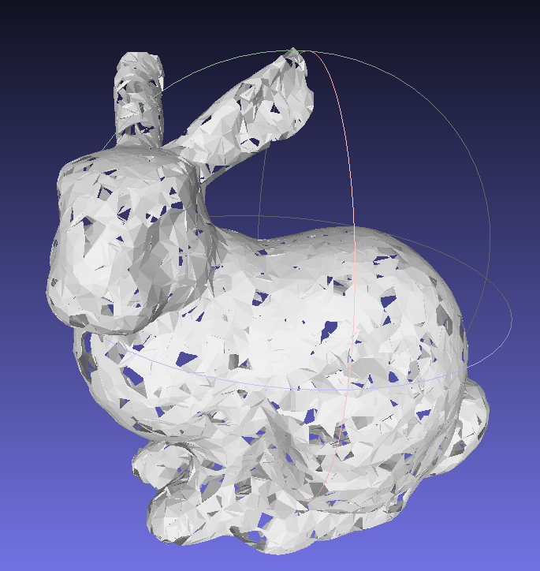

# Ball Pivoting Algorithm

This is an implementation of the ball pivoting algorithm in C++.
The objective is to reconstruct a mesh from a point cloud.

The algorithm originaly is described in the paper [The Ball-Pivoting Algorithm for Surface Reconstruction](https://www.cs.jhu.edu/~misha/Fall05/Papers/bernardini99.pdf) by Bernardini et al.

## Results

Cube | Bunny
--- | ---
 | 

## Installation from git

```
git clone --recurse-submodules https://github.com/apluquet/Ball-Pivoting-Algorithm
```

or 

```
git clone https://github.com/apluquet/Ball-Pivoting-Algorithm
git submodule init
git submodule update
```

## Usage

```
mkdir build && cd build
cmake ..
make
./ball_pivoting ../data/bunny.obj
meshlab mesh.obj # to visualize the result
```

## Contributors

- Adèle PLUQUET
- Adrien ANTON LUDWIG
